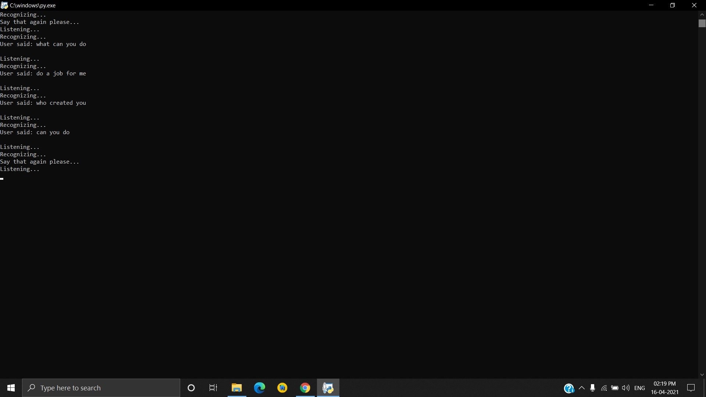

# JARVIS

## JARVIS with Python

[](https://github.com/ashish4626/JARVIS/issues)
[](https://github.com/ashish4626/JARVIS/network)
[](https://github.com/ashish4626/JARVIS/stargazers)
[](https://github.com/ashish4626/JARVIS/blob/master/LICENSE)



### Requirements:

<li>datetime</li>
<li>os</li>
<li> pyttsx3</li>
<li> wikipedia</li>
<li> speech_recognition </li>
<li> webbrowser</li>
<li> sys</li>
<li> smtplib</li>
<li>requests</li>
<li>json</li>
<li>defflib</li>
<li>geocoder</li>
<li>pyjokes</li>
<li>psutil</li>
<li> pyautogui</li>

<h2>Required Packages</h2>

```
pip3 install SpeechRecognition
pip3 install jsonlib
pip3 install pyttsx3
pip3 install PyAudio
pip3 install geocoder
pip3 install loc
pip3 install wikipedia
pip install psutil
pip install pyjokes


```
## If Error Occured to install PyAudio then try the following commands
```
pip install pipwin
pipwin install pyaudio

```

### On Ubuntu based Linux distribution you need to install the following packages, so that the code works:

```
sudo apt-get update && sudo apt-get install espeak

```

### What it does...

  <ul>
<li>Send emails</li>
  <li>Dynamic News Reporting at any time with api integration</li>
  <li>Todo list generator, Yes it remembers all!</li> 
<li>Open any website with just a voice command</li>
<li>Plays Music</li>
<li>Tells time</li>
<li>Wikipedia powered AI</li>
<li>Dictionary with Intelligent Sensing i.e. auto checking if spell mistake</li>
<li>Weather Report such as temp, wind speed, humidity, weather description</li>
<li>Latitude and longitude</li>
 <li>YouTube searching</li> 
 <li>Google Map searching</a>
 <li>YouTube Downloader, download any youtube video by just putting url of video</li>
 <li>Now Master can switch b/w JARVIS and FRIDAY, switch to female voice assistant</li>
</ul>

<table>
  <tr>
    <td></td>

</tr>
<tr>
<td></td>

<td></td>
</tr>
<td></td>
</tr>
</table>

## Some Sneak peeks:

<ul>
  <li><h2> Jarvis, Are you there?</h2></li>
  <li><h2> At your service, Sir</h2></li>
  
  <li><h2> Jarvis, What are today's news headlines? can you tell?</h2></li>
  <li><h2>Ofcourse, Sir -> Then news headlines   Would you like to visit the news url?</h2></li>
  
  <li><h2> Jarvis, Can you send email to Ashish Mishra?</h2></li>
  <li><h2> Email is sent successfully, Sir</h2></li>
  <li><h2> Search Youtube</h2></li>
  <li><h2>What you want to search, Sir</h2></li>
  <li><h2> Opens youtube in browser with desired search query results </h2></li>
  
   Enjoy This Freely!! :) 
